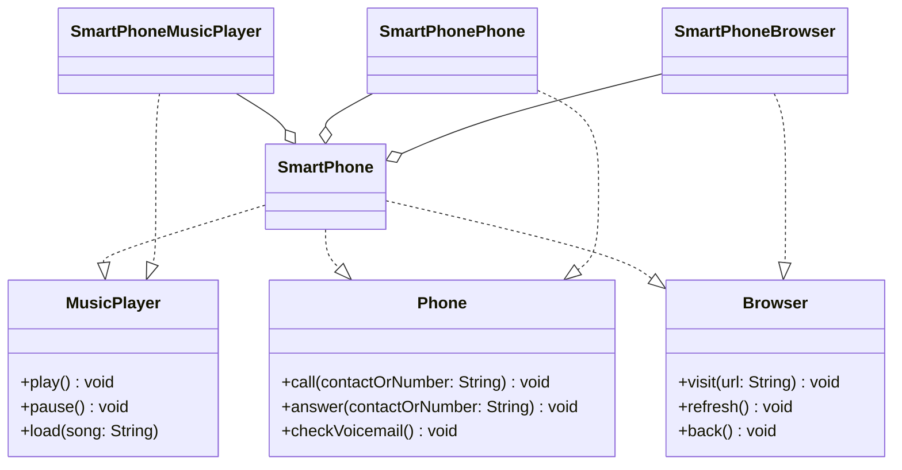

```mermaid
classDiagram
    class MusicPlayer {
        +play() void
        +pause() void
        +load(song: String)
    }

    class Phone {
      +call(contactOrNumber: String) void
      +answer(contactOrNumber: String) void
      +checkVoicemail() void
    }

    class Browser {
      +visit(url: String) void
      +refresh() void
      +back() void
    }

    class SmartPhone {
      
    }

    SmartPhone ..|> MusicPlayer
    SmartPhone ..|> Phone
    SmartPhone ..|> Browser
    
    SmartPhoneMusicPlayer ..|> MusicPlayer
    SmartPhonePhone ..|> Phone
    SmartPhoneBrowser ..|> Browser
    
    SmartPhoneMusicPlayer --o SmartPhone
    SmartPhonePhone --o SmartPhone
    SmartPhoneBrowser --o SmartPhone
    
```